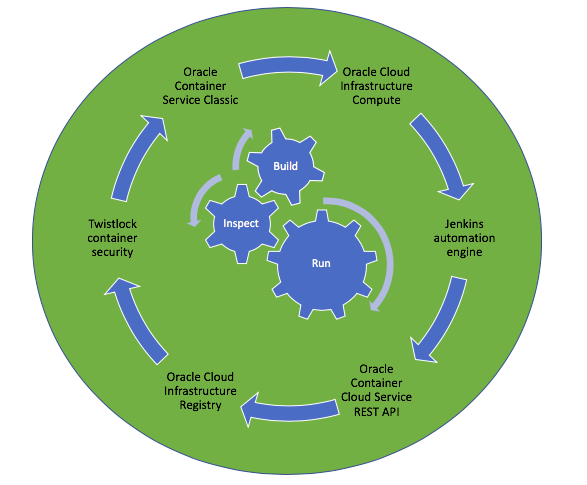
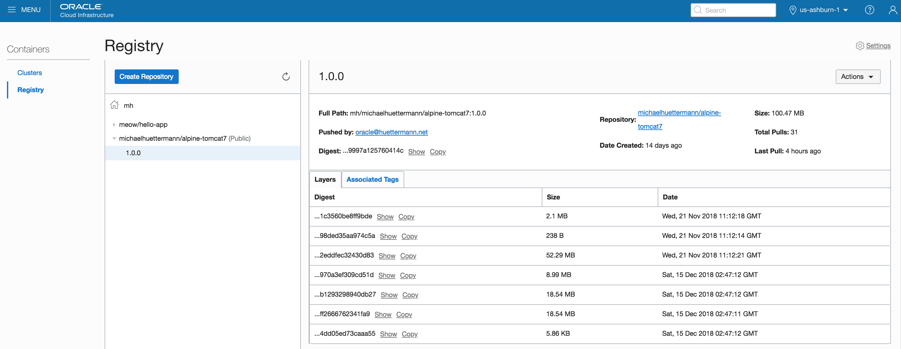
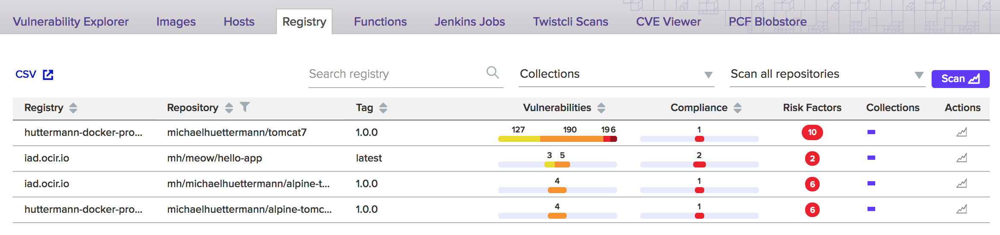
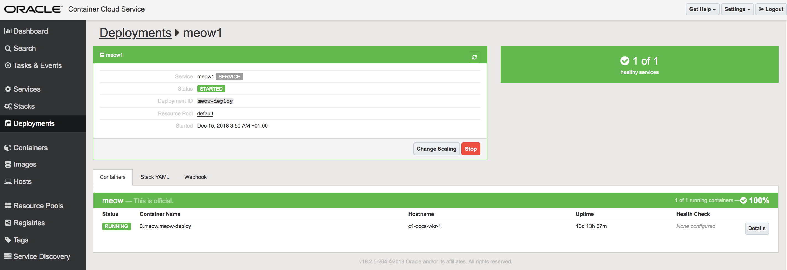

##### Deployment with/to Oracle Cloud Infrastructure

This example includes the Groovy based Jenkins build pipeline that takes a parameterized version of a Docker container, from *Oracle Cloud Infrastructure Registry*, and runs the container in *Oracle Container Service Classic*. 
*Twistlock* is utilized to 

Overview: the included components
 

Oracle Cloud Infrastructure Registry: the Docker images are hosted

Twistlock: content of Docker registry is inspected. Please note, this is just one use cases. 
 
 

Oracle Cloud Infrastructure Container Service Classic: Docker container runtime (service console)
  

##### Files
* create-deployment.json, define the deployment  
* new-service.json, define the service
* pipeline.groovy, the Jenkins pipeline groovy script, see 
[the running Blue Ocean here](http://129.213.104.3:8080/jenkins/blue/organizations/jenkins/Continuous_Delivery%2FProject-Cloud-Deploy/activity)

##### Parameters
`version`, the version to deploy.

##### Further information
* https://cloud.oracle.com/compute/
* https://www.twistlock.com/
* https://docs.oracle.com/en/cloud/iaas/container-cloud/
* https://cloud.oracle.com/containers/registry
* https://jenkins.io/blog/2018/11/12/inspecting-binaries-with-jenkins/