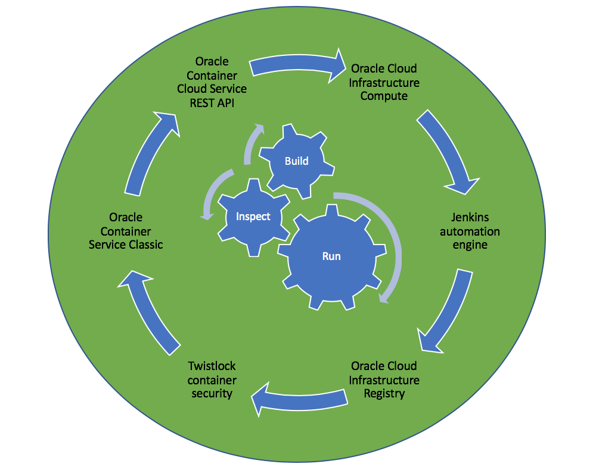

##### Deployment with/to Oracle Cloud Infrastructure

This example includes the Groovy based Jenkins build pipeline that takes a parameterized version of a Docker container, from *Oracle Cloud Infrastructure Registry*, and runs the container in *Oracle Container Service Classic*. 
*Twistlock* is utilized to 

 

 

##### Files
* create-deployment.json, define the deployment  
* new-service.json, define the service
* pipeline.groovy, the Jenkins pipeline groovy script, see 
[the running Blue Ocean here](http://129.213.104.3:8080/jenkins/blue/organizations/jenkins/Continuous_Delivery%2FProject-Cloud-Deploy/activity)

##### Parameters
`version`, the version to deploy.

##### Further information
* https://cloud.oracle.com/compute/
* https://www.twistlock.com/
* https://docs.oracle.com/en/cloud/iaas/container-cloud/