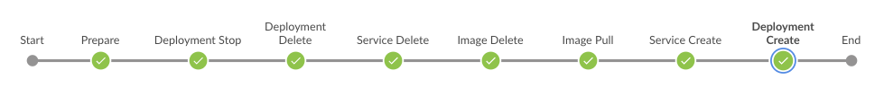

##### Deployment of a dockerized Java EE web application, with/to Oracle Cloud 

This example covers a promotion of a previously built Docker image toward production. 
The dockerized Java EE web application runs on Linux Alpine and Tomcat, with OpenJDK, and it is running 
[here](http://129.150.204.182:8002/all/). This is part of a [holistic workflow](https://github.com/michaelhuettermann/sandbox/tree/master/all/src/main/resources/jenkins) spanning several pipelines including build and test (multiple test 
categories) of the web application, package it with 
Docker, run different checks on source code and binaries, derive frozen versions by dynamically nailing down Maven snapshot versions, and 
allow to cherry-pick RC and GA versions. GA versions of the application are pushed to Oracle Cloud, and are then handled by
the pipeline (and thus toolchain) you find in this directory.

###### Overview: the included components.
 

The Docker images are hosted on *Oracle Cloud Infrastructure Registry* and from there they are deployed to the runtime environment that is 
*Oracle Container Service Classic*. *Twistlock* is utilized to inspect the images (with its layers, transitively) in the registry for known 
vulnerabilities. In order to demo the open architecture and feature-rich Oracle Cloud API, the parts are glued together by the Oracle Cloud REST API, 
however, you can of course also use any other integration depending on your basic conditions and individual requirements. 

###### Jenkins automation engine
 

A Jenkins build job is used to provision Docker images and run them on Oracle Cloud. 
The underlying script of the Jenkins pipeline is located in this directory. It can be viewed in action 
[as the Project Cloud Deploy here](http://129.213.104.3:8080/jenkins/blue/organizations/jenkins/pipelines/).
 
###### Oracle Cloud Infrastructure Registry: the Docker images are hosted.

The Docker images are hosted in Docker registries, on Oracle Cloud. The Docker images, managed by this pipeline, is an example of a primitive that can be aggregated to more complex setups.
The Dockerfile can be found 
[here](https://github.com/michaelhuettermann/sandbox/blob/master/all/src/main/resources/docker/alpine/Dockerfile).  
 
###### Twistlock: content of Docker registry is inspected.
 

Twistlock integrates with Oracle Cloud and inspects the Docker images located in the defined Docker registries. This is a valuable complementary security check, in addition
to build-time analyzes, also part of the overall workflow.

###### Oracle Cloud Infrastructure (OCI) Container Service Classic: Docker container runtime (service console).
  

OCI Container Classic uses units such as 
*stacks*, *services* and *deployments*, to aggregate and manage deployment units. Above all, the sample script does stop an existing deployment, if available, creates a new service and deployment, and 
finally runs the Docker image. 

##### Files
* **create-deployment.json**, define the deployment, according to Oracle Cloud API  
* **new-service.json**, define the service, according to Oracle Cloud API
* **pipeline.groovy**, the Jenkins pipeline groovy script

Please note, to underpin the underlying concept, the scripts are dynamically applying the current version. 
In this pipeline, the target version is injected by the user while triggering the pipeline. 
On the other side, to keep it simple, some items are hard-wired, e.g. the name of the Docker image.

##### Parameters of pipeline script
* `version`, the version of the Docker image to deploy, injected by upstream pipeline, and there injected by user
* `CLOUDIP`, the IP of the Container Console, as Jenkins environment variable, see [here](https://docs.oracle.com/en/cloud/iaas/container-cloud/contu/accessing-container-console-oracle-container-cloud-service.html)
* `ORACLE_BEARER`, the bearer, as Jenkins credential, see [here](https://docs.oracle.com/en/cloud/iaas/container-cloud/conta/op-token-post.html)

##### Further information
* https://cloud.oracle.com/compute/ Oracle Cloud Infrastructure Compute 
* https://docs.oracle.com/en/cloud/iaas/container-cloud/ Oracle Container Service Classic
* https://cloud.oracle.com/containers/registry/ Oracle Cloud Infrastructure Registry
* https://www.twistlock.com/ Twistlock
* https://jenkins.io/blog/2018/11/12/inspecting-binaries-with-jenkins/ Inspecting sources and binaries
* https://youtu.be/meC-u84o0xU Inspecting sources and binaries
* https://jenkins.io/blog/2017/04/18/continuousdelivery-devops-sonarqube/ Delivery pipelines, with SonarQube and Artifactory
* https://jenkins.io/blog/2017/07/05/continuousdelivery-devops-artifactory/ Delivery pipelines: how to promote Java EE and Docker binaries toward production
* https://github.com/michaelhuettermann/sandbox/tree/master/all/src/main/resources/jenkins The Jenkins pipelines
* https://github.com/michaelhuettermann/sandbox/tree/master/all The self-contained web app
