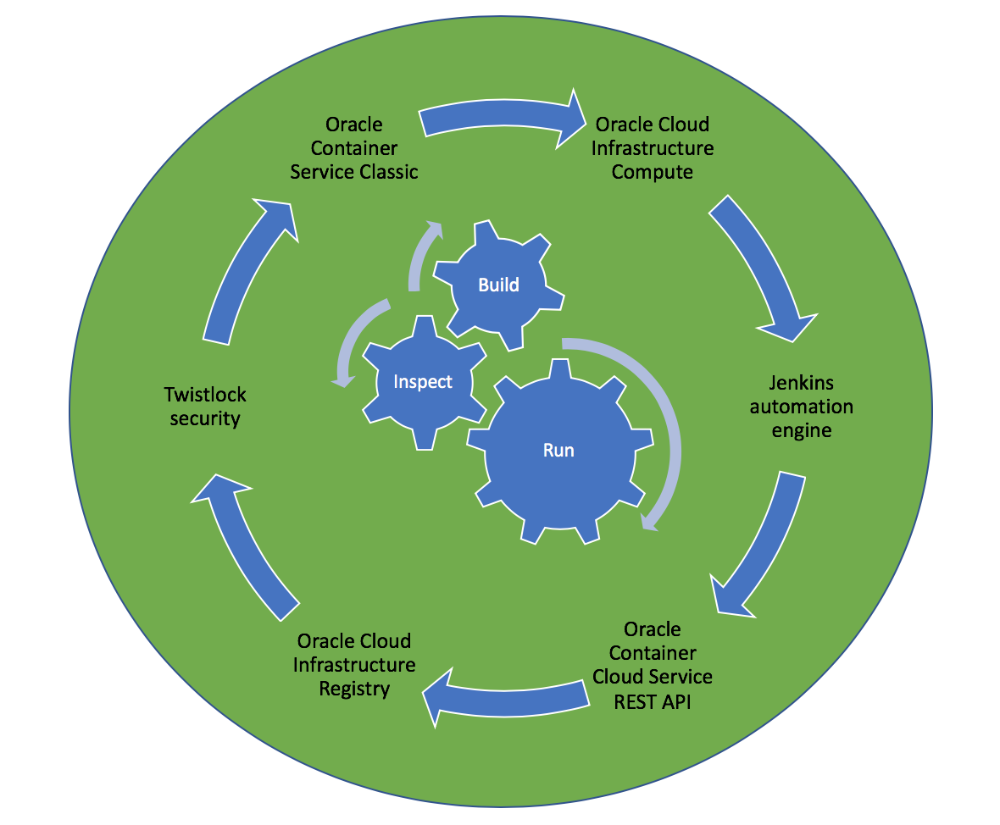
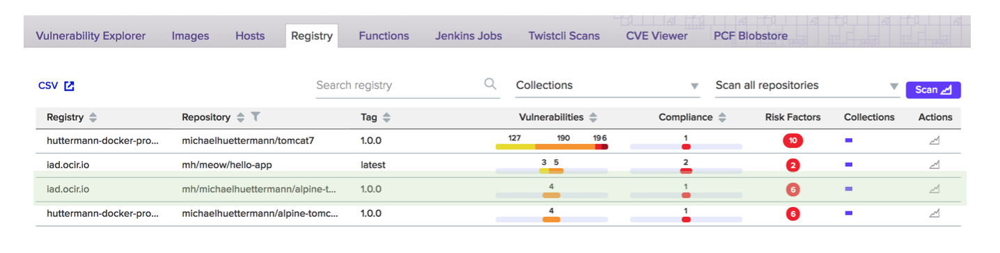

##### Deployment with/to Oracle Cloud 

This example promotes and runs a previously built Docker image, as part of a holistic workflow, toward production. 
The resulting web application, a dockerized Java EE web application, on Tomcat 9 and Linux Alpine, running OpenJDK 8, is running 
[here](http://129.150.204.182:8002/all/). This is part of a holistic workflow to build and test the web application, package it with 
Docker, run different checks, and derive RC and GA versions. In this use case, GA versions of the application are hosted on Oracle Cloud.

###### Overview: the included components.
 

The Docker image is hosted on *Oracle Cloud Infrastructure Registry* and from there it is deployed to the runtime environment that is 
*Oracle Container Service Classic*. *Twistlock* is utilized to inspect the images (with its layers, transitively) in the registry for known 
vulnerabilities. In order to demo the open architecture and feature-rich Oracle Cloud API, the parts are glued together by the Oracle Cloud REST API, however, you can of course
also use any other integrations depending on your basic conditions and individual requirements. 
 
###### Oracle Cloud Infrastructure Registry: the Docker images are hosted.

The Docker image is hosted on Oracle Cloud. This is an example of a primitive that can be aggregated to more complex setups, see 
[here](https://github.com/michaelhuettermann/sandbox/blob/master/all/src/main/resources/docker/alpine/Dockerfile).  
 

###### Twistlock: content of Docker registry is inspected.
 

Twistlock integrates with Oracle Cloud and inspects the Docker images managed in configured Docker registries.

###### Oracle Cloud Infrastructure Container Service Classic: Docker container runtime (service console).
  

Provisioning the Docker image and running it on Oracle Cloud, a Groovy based Jenkins build job is used. 
The Jenkins pipeline can be viewed 
[as the Project Cloud Deploy here](http://129.213.104.3:8080/jenkins/blue/organizations/jenkins/pipelines/), 

##### Files
* **create-deployment.json**, define the deployment, according to Oracle Cloud API  
* **new-service.json**, define the service, according to Oracle Cloud API
* **pipeline.groovy**, the Jenkins pipeline groovy script

##### Parameters of pipeline script
`version`, the version of the Docker image to deploy.

##### Further information
* https://cloud.oracle.com/compute/
* https://docs.oracle.com/en/cloud/iaas/container-cloud/
* https://cloud.oracle.com/containers/registry/
* https://www.twistlock.com/
* https://jenkins.io/blog/2018/11/12/inspecting-binaries-with-jenkins/
* https://youtu.be/meC-u84o0xU
